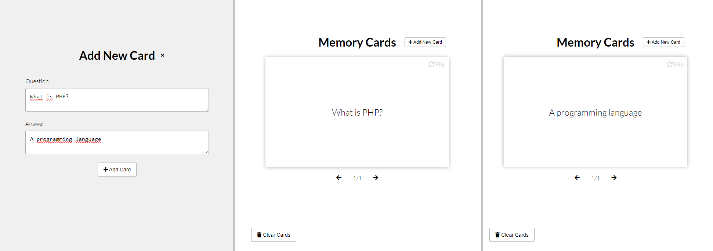

# Udemy--vanillawebprojects-14

**Thirteenth out** of a series of **20 small projects** in **Vanilla JavaScript** from the [**Udemy course**](https://www.udemy.com/course/web-projects-with-vanilla-javascript/) by author [Brad Traversy](https://www.traversymedia.com/) with this [Brad's original GitHub repository](https://github.com/bradtraversy/vanillawebprojects).

# 14: Memory Cards

Flash card app for learning. Display, add and remove memory cards with questions and answers

## Project Specifications

- Create flip cards using CSS
- Create "Add new card" overlay with form
- Display question cards and flip for answer
- View prev and next cards
- Add new cards to local storage
- Clear all cards from local storage

## Original preview

    

<!-- ## My solution preview

    

## My solution features

- same as an original -->

# Author

Website - [Petr Bednarski](https://github.com/pettik)  
Frontend Mentor - [@pettik](https://www.frontendmentor.io/profile/pettik)
